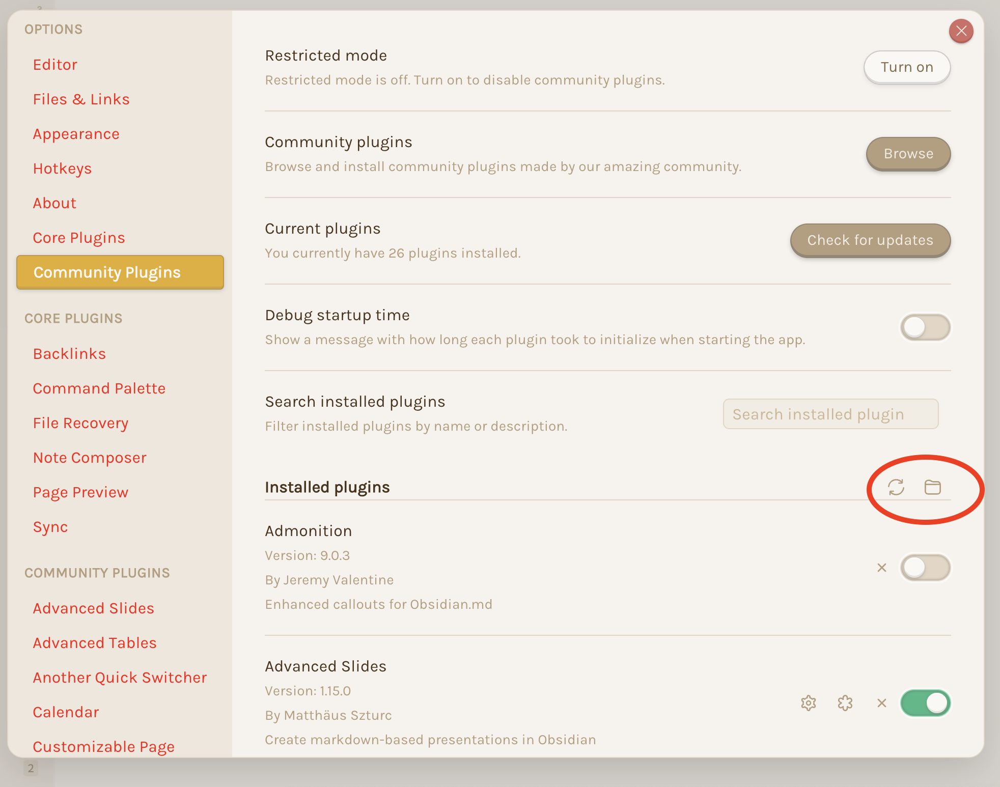

# Evernote Migration Plugin
The plugin is designed for [Obsidian](https://obsidian.md) to use Evernote as capturing tool.

## First time developing plugins?
Quick starting guide for new plugin devs:

- Check if [someone already developed a plugin for what you want](https://obsidian.md/plugins)! There might be an existing plugin similar enough that you can partner up with.
- Make a copy of this repo as a template with the "Use this template" button (login to GitHub if you don't see it).
- Clone your repo to a local development folder. For convenience, you can place this folder in your `.obsidian/plugins/your-plugin-name` folder.
- Install NodeJS, then run `npm i` in the command line under your repo folder.
- Run `npm run dev` to compile your plugin from `main.ts` to `main.js`.
- Make changes to `main.ts` (or create new `.ts` files). Those changes should be automatically compiled into `main.js`.
- Reload Obsidian to load the new version of your plugin.
- Enable plugin in settings window.
- For updates to the Obsidian API run `npm update` in the command line under your repo folder.

## Releasing new releases
- Update your `manifest.json` with your new version number, such as `1.0.1`, and the minimum Obsidian version required for your latest release.
- Update your `versions.json` file with `"new-plugin-version": "minimum-obsidian-version"` so older versions of Obsidian can download an older version of your plugin that's compatible.
- Create new GitHub release using your new version number as the "Tag version". Use the exact version number, don't include a prefix `v`. See here for an example: https://github.com/obsidianmd/obsidian-sample-plugin/releases
- Upload the files `manifest.json`, `main.js`, `styles.css` as binary attachments. Note: The manifest.json file must be in two places, first the root path of your repository and also in the release.
- Publish the release.

> You can simplify the version bump process by running `npm version patch`, `npm version minor` or `npm version major` after updating `minAppVersion` manually in `manifest.json`.
> The command will bump version in `manifest.json` and `package.json`, and add the entry for the new version to `versions.json`

## Adding your plugin to the community plugin list
- Check https://github.com/obsidianmd/obsidian-releases/blob/master/plugin-review.md
- Publish an initial version.
- Make sure you have a `README.md` file in the root of your repo.
- Make a pull request at https://github.com/obsidianmd/obsidian-releases to add your plugin.

## How to use
- Clone your repo to a local development folder. For convenience, you can place this folder in your `.obsidian/plugins/your-plugin-name` folder.
- `npm i` or `yarn` to install dependencies
- `npm run dev` to start compilation in watch mode.

## Obsidian plgin folder located
The location of the Obsidian plugin folder depends on the host operation system. To open the location open the Obsidian `settings`, open `Community Plugins` and click on the `folder icon` as shown in the screen shot.

## Manually installing the plugin
- Copy over `main.js`, `styles.css`, `manifest.json` to your vault `VaultFolder/.obsidian/plugins/your-plugin-id/`.

## Improve code quality with eslint (optional)
- [ESLint](https://eslint.org/) is a tool that analyzes your code to quickly find problems. You can run ESLint against your plugin to find common bugs and ways to improve your code. 
- To use eslint with this project, make sure to install eslint from terminal:
  - `npm install -g eslint`
- To use eslint to analyze this project use this command:
  - `eslint main.ts`
  - eslint will then create a report with suggestions for code improvement by file and line number.
- If your source code is in a folder, such as `src`, you can use eslint with this command to analyze all files in that folder:
  - `eslint .\src\`

## ToDo
- [x] get consumer key
- [x] get access key
- [x] update project docu
- [x] add settings for "Consumer Key" and "Consumer Secret"
- [x] import Evernote module
- [x] process oauth-response "oauth_token", "oauth_verifier", "sandbox_lnb"
- [x] redirect user to evernote login
- [ ] refactor evernote implementation
- [ ] store token credentials in settings

## API Documentation
See https://github.com/obsidianmd/obsidian-api
